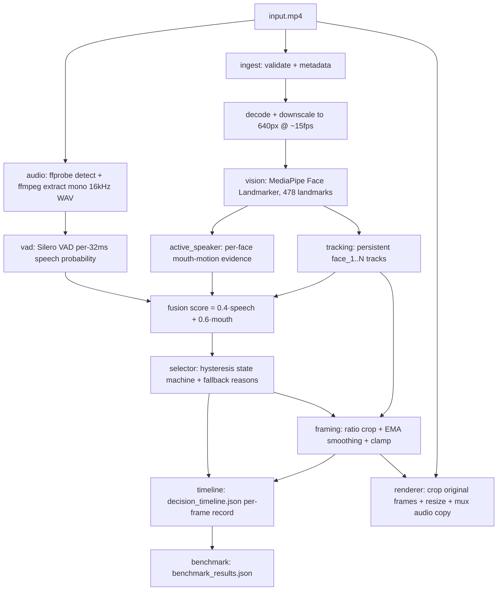

# Final Validation Report

Generated: 2026-09-08 20:05:22

- 17 scenarios: **17 passed**, **0 failed**, **0 skipped**

## 1. Executive Summary

This project reframes horizontal speaker videos into vertical outputs for
vertical-first viewing. Given an MP4 with one or more visible speakers, the
system detects who is speaking, follows that speaker with a smooth crop, and
renders a vertical video with the original audio preserved.

Key properties of the delivered system:

- **CPU-first, local execution.** Face detection (MediaPipe Face Landmarker),
  voice-activity detection (Silero VAD, ONNX CPU backend) and all decision
  logic run on the CPU. No GPU code, no cloud or paid services are used
  anywhere in the pipeline.
- **Supported outputs are 9:16 (1080x1920) and 1:1 (1080x1080).** Any other
  requested ratio is rejected with an error; the output resolution is derived
  from the requested ratio.
- **Active-speaker detection by explainable audio-visual fusion.** A global
  speech probability from the VAD is combined with per-face mouth-motion
  evidence into a weighted score with hysteresis. This is a hand-authored
  heuristic, not a trained speaker-detection network.
- **Auditable decision timeline.** Every analysis frame records the selected
  speaker (or the reason none was selected), evidence scores, crop
  coordinates and quality signals in `decision_timeline.json`.
- **Honest fallback behavior.** When no speaker can be selected (silence, no
  visible face, lost face track, or low confidence), the pipeline reports a
  machine-readable `fallback_reason` and crops a sensible default instead of
  guessing.

## 2. System Architecture

The pipeline is implemented in `main.py` (`run_pipeline`) with one module per
concern under `src/`. Data flows as follows:



Module responsibilities (`src/`):

- `ingest.py` — validates the input, reads metadata, yields downscaled
  analysis frames (640 px wide by default, ~15 fps sampling).
- `audio.py` — detects the audio stream and extracts a mono 16 kHz WAV via
  FFmpeg; reports audio as unavailable when there is no stream so the
  pipeline degrades to visual-only evidence.
- `vad.py` — Silero VAD wrapper producing a per-32 ms speech-probability
  signal, time-aligned queries, and speech intervals.
- `vision.py` — MediaPipe face detection, bounding boxes, mouth aperture,
  and per-frame visual-quality evidence (visibility, size, head pose, mouth
  visibility).
- `tracking.py` — centroid tracker maintaining persistent face IDs across
  frames with gap tolerance, overlap gating and motion prediction.
- `active_speaker.py` — mouth-motion evidence, audio-visual score fusion and
  the hysteresis selector with fallback reasons.
- `confidence.py` — documented weighted per-frame confidence model.
- `scene.py` — conservative hard-cut detection that resets transient state.
- `framing.py` — ratio crop calculation, smoothing, deadband/velocity
  control, boundary clamping and fallback crops.
- `aspect.py` — supported-ratio parsing/validation and output-size derivation.
- `timeline.py` — builds and writes `decision_timeline.json`.
- `benchmark.py` — deterministic run metrics (`--benchmark`).
- `renderer.py` — crops the original-resolution video, resizes, and muxes
  the original audio stream by copy.
- `config.py` — loads `config.yaml` into typed configuration sections.

**Analysis-vs-rendering separation.** All expensive per-frame work (face
detection, tracking, VAD queries, selection) runs once on small downscaled
frames (default 640 px wide at ~15 fps). Rendering is a second, cheap pass
that applies the recorded crop rectangles to the original-resolution frames
and copies the audio stream without re-encoding it. Measured log output from
a 6 s single-speaker run shows why this matters on CPU: of 2.94 s total
analysis time, face detection plus tracking took 1.61 s, VAD analysis took
0.13 s, and speaker selection took ~0.00 s. Rendering cost was not separately
measured (the measured runs used `--analysis-only`).

## 3. Active-Speaker Detection

The method is heuristic audio-visual fusion. There is no trained
speaker-classification network; every parameter below is a configured
constant from `config.yaml`.

- **Audio speech evidence.** The extracted WAV is analyzed by Silero VAD in
  512-sample (~32 ms) windows at 16 kHz. The raw probability signal is
  median-smoothed (window 3) and converted to speech intervals (threshold
  0.5, minimum speech 250 ms, short silences under 100 ms merged, 30 ms
  padding). For each video frame the pipeline takes the maximum probability
  over chunks overlapping a ±150 ms window (`audio_visual_window_ms: 300`).
- **Visual mouth-motion evidence.** For each visible face, the mouth aperture
  (vertical lip distance divided by mouth width, from MediaPipe landmarks) is
  tracked; evidence is the smoothed absolute change between consecutive
  analysis frames, averaged over 3 frames and normalized so a change of 0.10
  (`motion_scale`) saturates at 1.0. A still mouth yields ~0 evidence no
  matter how open it is. A face seen for the first time yields no evidence
  yet (there is no previous aperture to compare against).
- **Combination.** Per-face score = `0.4 * speech + 0.6 * mouth`
  (`audio_weight`, `mouth_weight`). The 0.4 audio weight is load-bearing: even
  perfect speech evidence alone (0.4) cannot pass the selection gate (0.5),
  so mouth motion is always required. This is deliberate to avoid attributing
  off-screen speech to a still face.
- **Speaker selection and switching.** The best-scoring face above the
  `minimum_confidence` gate (0.50) is selected. A hysteresis state machine
  (`NO_SPEAKER` / `SPEAKER_LOCKED` / `SPEAKER_SWITCH_PENDING` /
  `FALLBACK`) prevents flicker: a locked speaker is held through short gaps
  (500 ms hold), and a challenger must lead by a 0.10 margin for 3
  consecutive confirmation frames (~200 ms at 15 fps) before a switch
  commits with a `speaker_switch_event`. Every frame records its state and a
  `transition_reason`.
- **Confidence.** Two values are recorded. `active_speaker_confidence` is a
  documented heuristic (fused score × 1.25, clipped to [0, 1], not calibrated
  against ground truth). The stored per-frame `confidence` is the face
  detection confidence under strategy A, and under strategy B the documented
  evidence model `clamp(0.6·speech + 0.25·mouth + 0.15·visual) × (0.75 +
  0.25·track_quality)`, with all four components recorded per frame.
- **Fallback conditions.** When no face passes the gate the frame reports one
  of: `no_speech` (VAD below the 0.5 presence threshold),
  `low_active_speaker_confidence` (speech present but no convincing face),
  `no_visible_face` (nothing detected and nobody was locked), or
  `face_track_lost` (a previously locked speaker disappeared). Note: the
  codebase defines an `audio_unavailable` reason string, but the selector
  never emits it — a video with no audio stream is processed on visual
  evidence only and its silent frames report `no_speech`. The README's reason
  list should be read with that correction.

## 4. Tracking and Smart Reframing

- **Face tracking.** Detections are associated to tracks by centroid distance
  (within 0.5 frame widths) with an overlap gate (IoU ≥ 0.2 against the
  previous box when the track was seen on the last frame). Tracks survive up
  to 15 missed analysis frames or 1000 ms (`max_detection_gap_frames`,
  `max_track_gap_ms`), whichever expires first. Gaps of up to 3 frames are
  bridged with velocity prediction (decaying factor 0.75). Each track carries
  a `track_quality` score (0.7 × smoothed detection confidence + 0.3 ×
  continuity ramp over the first 20 tracked frames). IDs (`face_1`, …) persist
  while the track lives; a re-appearing face after expiry gets a new ID.
- **Crop calculation.** The crop is centered horizontally on the driving face
  with vertical padding of 1.2 face-heights above and 2.0 below
  (`face_padding_top/bottom`), sized to the target ratio and shrunk to fit
  the frame if necessary so the ratio is never distorted.
- **Boundary protection.** Every crop is clamped back inside the analysis
  frame while preserving its dimensions. The 17-scenario validation asserted
  zero out-of-bounds or degenerate crops on all assets, and the benchmark
  re-checks every crop against the recorded analysis resolution
  (`crop_bound_violations: 0` on all measured runs, see §7).
- **Smoothing and camera behavior.** Crop movement is smoothed with an
  exponential moving average (alpha 0.18). Under strategy B the camera
  additionally ignores sub-threshold drift (deadband 0.02 of frame width),
  caps per-frame center movement at 2.0% of frame width, and halves the
  smoothing rate for very small motions (below 4% of frame width), which
  visibly calms micro-jitter while still following real speaker moves.
  Measured on the two-speaker asset, the worst-5% crop jump dropped from
  29.5 px (A) to 11.5 px (B); mean motion was near-identical (4.56 vs
  4.30 px), confirming the cap only trims outliers.
- **Aspect handling.** 9:16 is the default; `--aspect-ratio 1:1` (or config)
  produces square crops (1080×1080 output). Any other ratio is rejected with
  an error and exit code 1; output height is always derived from the output
  width so the rendered file has exactly the requested ratio.
- **No reliable speaker.** If the driving face disappears, the last crop is
  held for up to 15 frames, then a centered ratio crop is used; the timeline
  keeps reporting `active_speaker_id: null` with the applicable fallback
  reason. The crop always follows the most-established visible face when one
  exists, so the camera never points at empty space while a face is visible.

## 5. Strategy Comparison

- **Strategy A (baseline).** Passes the loaded configuration through
  untouched: detection-confidence values, no track-quality gate, plain EMA
  smoothing. This is the reference behavior.
- **Strategy B (enhanced).** Enables three config-gated improvements on top
  of identical components: (1) the stored per-frame `confidence` becomes the
  documented evidence-model value instead of the detection confidence;
  (2) a track-quality gate (`min_track_quality` 0.5) makes faces below the
  floor ineligible to take or hold the speaker role, so a collapsing track
  steps down immediately; (3) the smarter framing defaults (deadband 0.02,
  2.0%/frame velocity cap). Any explicit YAML value overrides the strategy
  default, so each improvement can be tuned independently.

**Measured comparison** (fresh runs for this report, 2026-09-11, same
machine and session, `--analysis-only --benchmark`, one run per cell —
`main.py --input test_assets/<asset>.mp4 --output <tmp>/out.mp4
--analysis-only --benchmark --strategy <A|B>`):

| Asset (source) | Strategy | Speaker frames | Switches | Fallback | Confidence mean | Jitter p95 (px) | Bound violations | Analysis s / realtime |
|---|---|---|---|---|---|---|---|---|
| single speaker, 6.0 s, 90 frames | A | 77/90 (0.856) | 0 | 13 × `no_speech` | 0.500 (flat passthrough) | 0.5 | 0 | 2.936 / 0.489 |
| single speaker, 6.0 s, 90 frames | B | 70/90 (0.778) | 0 | 13 × `no_speech`, 7 × `low_active_speaker_confidence` | 0.447 (spread 0.059–0.811) | 0.5 | 0 | 2.720 / 0.453 |
| two speakers, 9.0 s, 135 frames | A | 133/135 (0.985) | 2 | 2 × `no_speech` | 0.500 (flat passthrough) | 29.5 | 0 | 4.807 / 0.534 |
| two speakers, 9.0 s, 135 frames | B | 126/135 (0.933) | 2 | 2 × `no_speech`, 7 × `low_active_speaker_confidence` | 0.702 (spread 0.061–0.838) | 11.5 | 0 | 4.940 / 0.549 |

Observed, without over-claiming: both strategies select the same speakers
with the same switch counts; B abstains slightly more often (the 7 extra
`low_active_speaker_confidence` frames in each asset come from the quality
gate and the stricter model confidence); B's confidence carries real
information (spread 0.06–0.84) where A's is a flat 0.5 passthrough on these
assets; B trims the largest crop jumps. Runtime is in the same class for
both (2.7–2.9 s and 4.8–4.9 s here); neither strategy adds a model or
meaningful CPU cost, since B only changes gating constants and the
confidence arithmetic. No accuracy percentages are claimed — the assets are
small synthetic clips, and correctness is asserted per-scenario in §6, not
as a score.

## 6. Validation and Test Matrix

The committed validation matrix below is preserved unchanged (17 scenarios,
all passing). Each scenario runs the real `main.run_pipeline` CPU-only
pipeline and asserts behavioral expectations; anything unimplemented fails
loudly instead of being skipped.

## Results

| # | Scenario | Asset | Strategy | Aspect | Benchmark | Status | Time (s) | Detail |
|---|----------|-------|----------|--------|-----------|--------|----------|--------|
| 1 | s1_single_a | single_speaker_speech | A | 9:16 | - | pass | 5.61 |  |
| 2 | s2_single_b | single_speaker_speech | B | 9:16 | - | pass | 2.5 |  |
| 3 | s3_two_a | two_speakers | A | 9:16 | - | pass | 3.61 |  |
| 4 | s4_two_b | two_speakers | B | 9:16 | - | pass | 3.57 |  |
| 5 | s5_silence_a | silence_speaker | A | 9:16 | - | pass | 2.48 |  |
| 6 | s6_silence_b | silence_speaker | B | 9:16 | - | pass | 2.46 |  |
| 7 | s7_faceloss_a | face_loss | A | 9:16 | - | pass | 2.89 |  |
| 8 | s8_faceloss_b | face_loss | B | 9:16 | - | pass | 2.88 |  |
| 9 | s9_offscreen_a | off_screen_speech | A | 9:16 | - | pass | 2.62 |  |
| 10 | s10_offscreen_b | off_screen_speech | B | 9:16 | - | pass | 2.74 |  |
| 11 | s11_noface_a | no_face_speech | A | 9:16 | - | pass | 1.03 |  |
| 12 | s12_noface_b | no_face_speech | B | 9:16 | - | pass | 1.04 |  |
| 13 | s13_single_1to1 | single_speaker_speech | A | 1:1 | - | pass | 5.29 |  |
| 14 | s14_two_b_benchmark | two_speakers | B | 9:16 | yes | pass | 3.59 |  |
| 15 | s15_silence_1to1 | silence_speaker | A | 1:1 | - | pass | 2.45 |  |
| 16 | s16_three_in_frame | 3_in_a_frame | A | 9:16 | - | pass | 24.97 |  |
| 17 | s17_stock_video | stock_vid | A | 9:16 | - | pass | 8.74 |  |

## Notes

- Every scenario runs the real `main.run_pipeline` (CPU-only) on the
  deterministic synthetic assets; scenarios with an unimplemented
  expectation fail loudly rather than being skipped.
- Strategy A must reproduce the baseline behavior exactly; strategy B
  adds the track-quality speaker gate and smarter framing.
- Crop bound violations are validated against the recorded analysis
  resolution; `confidence` must always stay in [0, 1].
- `--benchmark` outputs `realtime_factor`, the confidence distribution,
  and bound-violation metrics.

Coverage mapping:

- **Single-speaker movement** (s1, s2, s13): one talking face stays locked
  with zero switch events under both strategies and both aspect ratios.
- **Two visible speakers** (s3, s4, s14): alternating speech produces ≥2
  switch events with both faces selected, plus a full benchmark run.
- **Silence** (s5, s6, s15): static face with silent audio never selects a
  speaker; every frame reports `no_speech`, under both strategies and 1:1.
- **Face loss and re-entry** (s7, s8): a 2 s disappearance reports
  `face_track_lost` (never `no_visible_face` once someone was locked) and
  the speaker re-locks afterwards.
- **Off-screen speech** (s9, s10): speech with no moving lips never selects
  anyone; reasons stay within `no_speech` / `low_active_speaker_confidence`.
- **No visible face** (s11, s12): speech with no faces reports
  `no_visible_face` on every frame.
- **Multiple people** (s16, 31.8 s 4K clip): pipeline completes, tracks
  faces, keeps every crop valid with only known fallback reasons.
- **9:16** (s1–s12, s14, s16, s17) and **1:1** (s13, s15, with square crops
  asserted per frame).
- **Benchmark execution** (s14): `benchmark_results.json` validated for
  `realtime_factor`, confidence distribution and zero bound violations.
- **Stock / difficult content** (s17, 17.5 s real footage): completes with
  valid crops and confidences in [0, 1].

Test layers, distinguished:

- **Automated unit tests** (`tests/test_*.py`: VAD helpers, audio handling,
  mouth evidence, fusion/hysteresis, tracking, config, timeline schema,
  confidence, state machine, scene detection, framing, aspects, strategy
  wiring, benchmark math) run without media in seconds.
- **End-to-end pipeline tests** run `main.run_pipeline` in-process (or the
  CLI in a subprocess) against synthetic assets and assert the behaviors
  above; asset-dependent tests skip gracefully when a file is absent.
- **Benchmark tests** assert the structure and invariants of
  `benchmark_results.json` (realtime factor present, confidence distribution
  present, zero bound violations on synthetic assets).
- **The 17-scenario matrix** (`python scripts/run_validation.py`, or
  `FULL_VALIDATION=1 python -m pytest tests/test_validation.py`) is the
  gated full pass recorded above (81.7 s at the time of the committed run).
- **Manual observations:** no formal manual viewing protocol is recorded in
  the repository. The multi-person and stock-footage scenarios are automated
  smoke checks (valid crops, known fallback reasons, confidence in range),
  not human-graded accuracy judgments.

## 7. Benchmark and CPU Performance

The benchmark (`src/benchmark.py`, schema `benchmark_v1`) computes, per run:
speaker/fallback proportions and counts, switch-event count, fallback-reason
counts, longest/mean speaker run lengths, crop-center jitter and velocity
(mean/p95 in analysis-frame pixels), the per-frame confidence distribution
(min/mean/p95/max), crop bound-violation count and in-bounds proportion, and
timing (`analysis_seconds`, `source_duration_seconds`, `realtime_factor` =
analysis ÷ source).

Measured values below come from the four fresh runs in §5 (single-speaker
6.0 s / 90 frames and two-speaker 9.0 s / 135 frames assets, 9:16,
`--analysis-only --benchmark`, one run per cell, same machine and session):

- **Runtime / realtime factor:** 2.936 s (0.489×) single/A, 2.720 s
  (0.453×) single/B, 4.807 s (0.534×) two/A, 4.940 s (0.549×) two/B.
  Analysis runs at roughly half realtime on these short clips (factors
  below 1.0 mean faster than the footage duration). Single-run timings;
  run-to-run variance was not measured.
- **Timing split (from run logs):** VAD analysis 0.132 s of 2.94 s total
  (6 s audio, 188 chunks) and 0.133 s of 4.81 s total (9 s audio, 282
  chunks); face detection plus tracking 1.61 s and 3.85 s respectively;
  speaker selection ~0.00–0.01 s. Vision dominates CPU cost; fusion is
  negligible. Rendering cost was not separately measured (analysis-only runs).
- **Quality metrics:** speaker proportions 0.856/0.778 (single A/B) and
  0.985/0.933 (two A/B); switch events 0 and 2 respectively, identical
  across strategies; longest speaker runs 54/47 and 133/126 frames.
- **Crop-bound violations:** 0 on all four runs (in-bounds proportion 1.0),
  consistent with the per-scenario bound assertions in §6.
- **Confidence distribution:** flat 0.500/0.500/0.500/0.500 under A
  (detection-confidence passthrough on these assets) vs 0.059/0.447/0.798 /
  0.811 (single B) and 0.061/0.702/0.822/0.838 (two B) under the evidence
  model (min/mean/p95/max).
- **CPU/machine information:** the benchmark records `"device": "cpu"` per
  run. Machine make, core count, OS build and Python environment details:
  not measured in the current benchmark run.
- **Number of repetitions:** one run per cell in §5; the committed §6 matrix
  is likewise a single pass. Repeat-variance: not measured in the current
  benchmark run.
- **Peak memory:** not measured in the current benchmark run.
- **Model sizes on disk:** not measured in the current benchmark run (both
  models ship inside their wheels / landmark cache per SOURCES.md; no
  separate checkpoint files are committed).

## 8. Failures and Limitations

Passing automated tests are not the same as real-world robustness. Known
limitations, all grounded in the implementation or observed during testing:

- **Still face plus speech is never selected.** With `audio_weight` 0.4
  against the 0.50 gate, speech alone cannot select anyone. Correct for
  off-screen speech, but a real speaker who barely moves their lips while
  talking will be missed. This is the largest functional limitation of the
  heuristic.
- **Side profiles and strong head turns are de-rated.** The head-pose
  heuristic drives `visual_quality` toward 0 as the nose projects away from
  the eye-line midpoint, and the weakest-link minimum propagates that into
  the confidence. Profile speakers are therefore unlikely to be selected;
  no profile-heavy test asset exists to quantify this.
- **Mouth-motion reliability.** Evidence depends on landmark aperture noise
  frame-to-frame; distant or small faces (roughly under ~100 px wide at
  640 px analysis width) may not be detected at all, and subtle lip movement
  near the 0.10 saturation scale may not register.
- **Occlusion and partial faces.** Landmarks clamped to the image edge lower
  the visibility fractions, which honestly lower confidence but also cost
  selection. There is no occlusion-specific handling or test asset.
- **Rapid overlap and interjections.** The 500 ms hold plus 0.10 margin plus
  3 confirmation frames delay switches by design; a quick interjection will
  typically not take the floor, and simultaneous speech resolves to the
  higher fused score rather than true diarization (which is out of scope).
- **Gradual scene transitions.** The cut detector needs large outlier
  changes on two consecutive frames; slow fades, wipes or lighting ramps
  will likely not trigger a reset, so tracker and speaker state carry across
  them. Only hard cuts are handled and only hard-cut behavior is tested
  (including an explicit zero-false-positive check on the synthetic assets).
- **Fallback reporting gap.** `audio_unavailable` is defined but never
  emitted; silent or audio-less footage reports `no_speech`. The README
  reason list overstates this one entry.
- **Evidence is synthetic-only.** All accuracy-style assertions run on
  six short deterministic synthetic clips plus two smoke-checked real clips.
  There is no labeled real-world evaluation set, so no precision/recall or
  robustness claim beyond §6 is supported.
- **Performance evidence is thin.** Timings are single runs on short clips;
  variance, memory, long-form footage behavior (the 31.8 s 4K scenario took
  25.0 s end-to-end in the matrix) and render-pass cost are unmeasured.

## 9. Engineering Trade-offs

- **CPU-first vs heavier neural models.** A trained audio-visual speaker
  network would likely beat the heuristic on profiles and still faces, but
  would break the CPU-only, offline, dependency-light constraints and need
  labeled training data. The heuristic keeps every decision inspectable,
  which the assessment's auditability requirement favors.
- **Analysis resolution vs accuracy (640 px).** Downscaling cuts MediaPipe
  cost roughly quadratically while faces remain detectable; the price is
  small/distant faces dropping out. Configurable via `analysis_width`.
- **Sparse analysis (~15 fps) vs full-frame processing.** Sampling halves the
  detection bill; the cost is up to ~200 ms of selection latency stacking
  with the confirmation logic, and slightly steppy fast motion (the last crop
  is held between analysis points).
- **Heuristic fusion vs trained models.** Chosen for explainability and zero
  training data; paid for with the still-face and profile weaknesses in §8.
- **Smoothing vs responsiveness (EMA 0.18, plus deadband/velocity cap under
  B).** Heavier smoothing calms the virtual camera but lags fast speaker
  changes; B's cap only trims outlier jumps (measured p95 drop 29.5 → 11.5 px
  with near-identical means), a good compromise borne out by the numbers.
- **Conservative fallback vs aggressive selection.** The 0.50 gate, hold time
  and confirmation frames prefer `no_speech`/low-confidence abstention over
  misattribution. Right for a reframing tool where a wrong cut is worse than
  a held shot.
- **Original-resolution rendering vs downscaled analysis.** Decisions are
  cheap (small frames) while pixels stay sharp (full-resolution crop and
  resize, audio copied not re-encoded). The trade-off is a second decode
  pass over the source.

## 10. Security, Safety, Licensing and Rights

Per `SOURCES.md` and `AI_USE.md`, cross-checked 2026-09-11:

- **Local processing.** Everything runs on the local CPU. The only network
  access in the entire system is MediaPipe's first-run download of the face
  landmark model if the wheel does not already bundle it (cached afterwards
  under `~/.mediapipe/models`); the pipeline itself calls no cloud, paid,
  GPU or external inference service.
- **No secrets or credentials.** A repository-wide scan found no API keys,
  tokens, credentials, key files or account identifiers; none are needed —
  configuration is plain YAML with no secret fields.
- **No paid generation APIs.** Test speech is synthesized offline with the
  FFmpeg `flite` filter (a local synthesizer, not a generative model); no
  AI-generated runtime media is used.
- **Media rights and provenance.** The two test assets shipped in
  `test_assets/` are synthetic clips generated by the repository's own
  `scripts/build_test_assets.py` (animated faces plus synthesized speech;
  byte-identical to the generator's documented outputs). Larger stock and
  online-sourced clips present during development were excluded from the
  submission; no third-party footage is redistributed.
- **Third-party licenses** (exactly as listed in `SOURCES.md`):
  OpenCV (Apache-2.0), MediaPipe + landmark model (Apache-2.0), NumPy
  (BSD-3-Clause), PyYAML (MIT), CPU PyTorch (BSD-3-Clause), Silero VAD
  v6.2.1 (MIT, model files ship inside the wheel), soundfile/libsndfile
  (BSD-3-Clause / LGPL-2.1), ONNX Runtime (MIT), pytest (MIT),
  FFmpeg/FFprobe (LGPL-2.1-or-later/GPL depending on build), flite
  (BSD-3-Clause). No license claim is made here beyond that file.
- **AI coding assistance disclosure** (per `AI_USE.md`): an AI coding
  assistant was used to write, review and test the code under continuous
  human direction; all decision logic is hand-authored deterministic Python;
  no personal or user data leaves the machine.

## 11. Product Recommendation

The implementation is suitable as a **working prototype and CPU-local proof
of concept**: it runs end to end on real footage, its decisions are fully
auditable per frame, and its measured behavior (17/17 validation scenarios,
zero bound violations, sub-realtime analysis on short clips) supports
demonstration and further development.

It is **not production-ready**. Before any production deployment it would
need, at minimum: a stronger speaker model for still faces and profiles
(the heuristic's two biggest gaps), a sizable labeled evaluation set with
real precision/recall tracking, robustness testing across lighting,
occlusion, crowds and long-form content, repeated performance and memory
profiling, and operational monitoring/logging around fallback rates. None of
these exist yet, and none are claimed.

## 12. Next Steps

1. **Active-speaker robustness.** Raise recall on still faces and profile
   views without losing the off-screen-speech rejection — e.g. evaluate a
   small trained audio-visual head against the current gate behavior.
2. **Difficult visual conditions.** Add assets and handling for occlusion,
   low light, crowds and small faces; quantify the visibility/pose
   de-rating curves instead of relying on smoke checks.
3. **Larger labeled evaluation set.** Build a labeled real-footage set with
   per-segment speaker labels so switches, holds and fallbacks can be scored
   instead of asserted on synthetic clips.
4. **Benchmark and quality measurement.** Repeat runs with variance, record
   peak memory and render-pass cost, log machine specs per run, and add a
   crop-stability perceptual check alongside the pixel metrics.
5. **Production integration.** Harden input validation and error paths,
   add fallback-rate monitoring, package a locked dependency set, and
   document the first-run model-download behavior for offline environments.

## 13. Reproducibility

Exact commands from `README.md` (verified against `main.py` flags and the
files in this repository):

```bash
# Environment setup (CPU-only)
python -m venv .venv
# Windows:
.venv\Scripts\activate
# macOS/Linux:
source .venv/bin/activate

# Dependency installation
pip install -r requirements.txt
# CPU-only PyTorch wheel (Windows):
pip install torch --index-url https://download.pytorch.org/whl/cpu

# Test suite
python -m pytest tests/ -v

# Representative pipeline run (analysis + rendering)
python main.py \
    --input test_assets/single_speaker.mp4 \
    --output output/reframed.mp4

# Analysis only (timeline without rendering)
python main.py \
    --input test_assets/two_speakers.mp4 \
    --output output/reframed.mp4 \
    --analysis-only

# Benchmark run (writes benchmark_results.json next to the timeline)
python main.py \
    --input test_assets/two_speakers.mp4 \
    --output output/reframed.mp4 \
    --benchmark

# Full 17-scenario validation matrix (writes VALIDATION_REPORT.md)
python scripts/run_validation.py
$env:FULL_VALIDATION = "1"                  # or via pytest:
python -m pytest tests/test_validation.py -o addopts= -q
```

Notes: FFmpeg must be on PATH (audio extraction and final mux). On first
face detection, MediaPipe fetches its landmark model once and caches it
under `~/.mediapipe/models`; subsequent runs are fully offline. Strategy and
aspect variants: append `--strategy B` and/or `--aspect-ratio 1:1` to any
pipeline command above.

## 14. Conclusion

Implemented: a CPU-only active-speaker reframing pipeline that fuses Silero
VAD speech evidence with MediaPipe mouth-motion evidence through an
explainable scored selector with hysteresis, tracks faces persistently,
frames smoothed 9:16/1:1 crops with boundary guarantees, resets cleanly on
hard scene cuts, and records every frame's decision plus run-level benchmark
metrics — with two strategies (untouched baseline, and an enhanced variant
adding a track-quality gate, evidence-model confidence and calmer framing).

Successfully validated: all 17 matrix scenarios pass, covering locking,
switching, silence, face loss and re-entry, off-screen speech, faceless
speech, both aspect ratios and benchmark execution; fresh A/B benchmark runs
show identical switch behavior, slightly more conservative abstention under
the enhanced strategy, informative confidence spreads, zero crop-bound
violations and ~0.45–0.55× realtime analysis on short clips.

Important limitations: still-face speech and profile views are systematically
missed by the heuristic; gradual transitions are not detected; evidence is
synthetic-only with single-run timings and no memory profiling; one
documented fallback reason (`audio_unavailable`) is never actually emitted.

The design is appropriate for the assessment because it meets every stated
constraint — local CPU execution, no paid services, explainable decisions,
auditable outputs — while reporting its weaknesses plainly instead of
optimizing for the test set.
